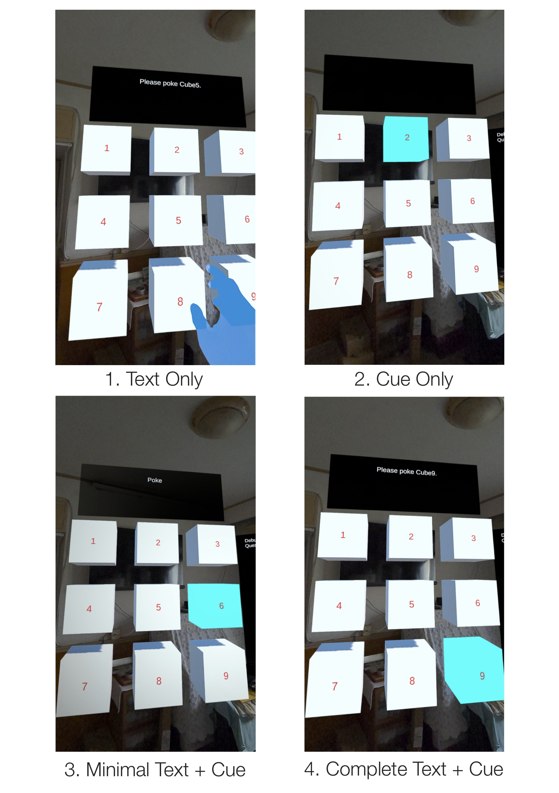
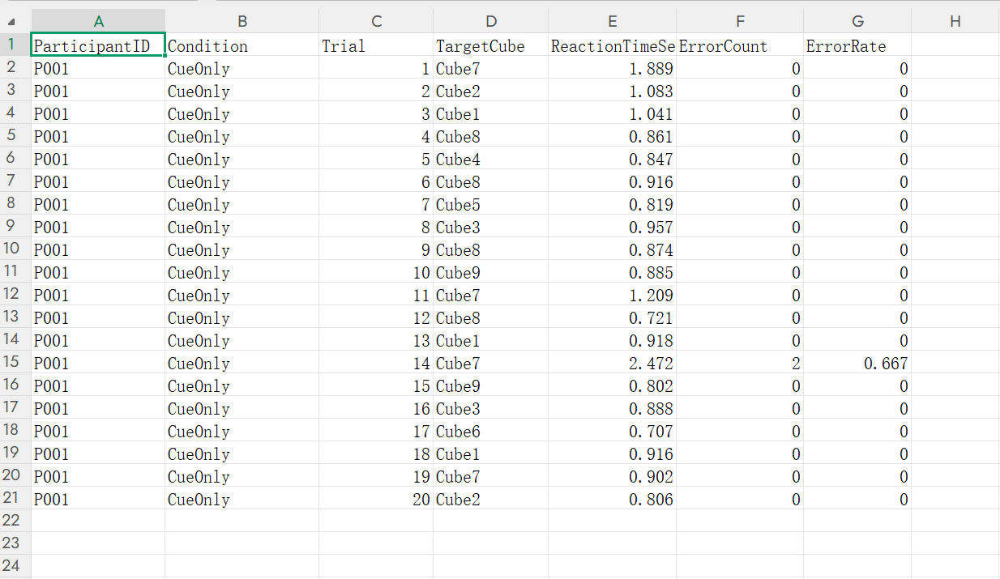

## Perceptual Cue Interpretability in Mixed Reality Task Guidance

This project presents a Mixed Reality experimental prototype for investigating how perceptual cues can complement or partially replace textual instructions in task guidance. The experiment focuses on the interpretability of perceptual cues. It is designed to test whether users can infer an intended action from visual guidance with reduced textual information, and how different combinations of textual and perceptual information affect task performance.

### Technical Setup

- **Headset:** Meta Quest 3
- **Engine:** Unity 2022.3.20
- **XR Platform:** Meta XR SDK
- **Environment:** Mixed Reality with passthrough
- **Interaction:** Hand tracking and poke interaction (no controllers)
- **Data Logging:** Automatic CSV export

### Project Status

The experimental prototype is fully implemented and operational on Meta Quest 3. The current system supports all four experimental conditions, hand-based poke interaction, automatic trial progression, performance measurement, and CSV data logging.

Formal participant recruitment and evaluation have not yet been conducted.

### Research Question

RQ: To what extent can perceptual cues reduce or replace textual information in MR task guidance while preserving effective user interpretation and task performance?

Note: Cue saliency is treated as a prerequisite rather than the primary research question, a cue must first be noticeable before its semantic interpretability can be meaningfully evaluated.

| Condition              | Textual Information   | Perceptual Cue          |
| ---------------------- | --------------------- | ----------------------- |
| 1. Text Only           | "Please poke Cube[X]" | None                    |
| 2. Cue Only            | None                  | Target cube highlighted |
| 3. Minimal Text + Cue  | "Poke"                | Target cube highlighted |
| 4. Complete Text + Cue | "Please poke Cube[X]" | Target cube highlighted |

### Experiment Procedure:

Participants enter the MR environment by wearing Meta Quest 3 and interact with the virtual objects using hand tracking. Before the experiment, participants are informed of the general experimental context, but are not explicitly instructed about how individual visual cues should be interpreted. During the experiment, users are supposed to touch the highlighted cube (light blue) with their hands, and there will be 20 trials in total. Each participant would only receive task of one experimental condition.

### Measurements:

For each participant and experimental condition, the system automatically records:

- Participant ID

- Experimental condition

- Reaction time

- Error count

- Error rate

All measurements are automatically exported as CSV files for subsequent analysis.

*The data shown above were generated during system testing and are included only to demonstrate the data-logging pipeline. They do not represent results from a formal participant study.*

### Research Hypotheses:

H1: A perceptual cue alone may be insufficient to communicate the intended action. Therefore, the first-trial reaction time in the Cue Only condition is expected to be longer.

H2: Interaction feedback may allow participants to infer the meaning of the cue. Therefore, reaction times in subsequent Cue Only trials are expected to decrease.

H3: Adding a perceptual cue to complete textual instructions is expected to improve target localization, resulting in shorter reaction times and fewer errors than Text Only.

H4: Minimal text combined with a perceptual cue may provide sufficient semantic information while reducing textual processing demands, potentially resulting in better task performance than Complete Text + Cue.

### Current Status and Limitations:

This prototype currently only serves as a pilot research prototype. No formal participant study has been conducted yet, and the available sample data were generated during system testing.

More importantly, the current highlighting cue primarily communicates target relevance or location, rather than explicitly encoding the action semantics of “poke this object.”  Therefore, this experiment alone cannot determine which semantic components of a textual instruction can be replaced by perceptual cues.

Instead, the prototype demonstrates the technical and methodological pipeline required for future controlled studies, including MR interaction, experimental condition control, automatic performance measurement, and data logging.

### Future Work:

Future work will extend the prototype toward a library of perceptual cues designed to encode different types of task information, including target selection, action and operation guidance, spatial guidance, and interaction feedback.

The longer-term research direction is to integrate real-world object understanding and environment-aware AI, enabling an intelligent system to select appropriate perceptual cues according to the current task and environment.

This contributes to the longer-term goal of developing an AI-assisted perceptual guidance system for Mixed Reality.
